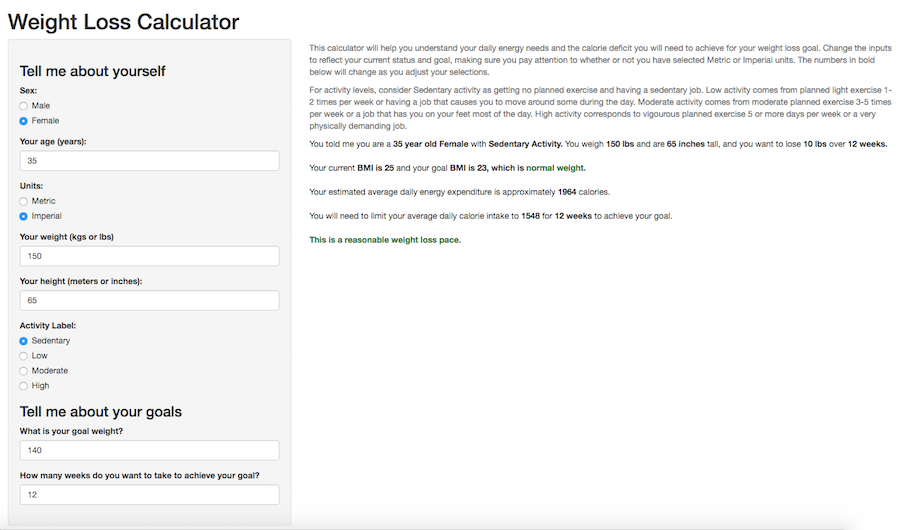

## Data Products Final Project: Weight Loss Calculator

Overview of Functionality

1. Calculator takes input:
    Age, Sex, Weight, Height, Activity Level
2. Calculator outputs:
    Current BMI, Goal BMI, Daily Calorie Expenditure, Daily Calorie Need for Target Weight Loss, Comments

https://sjevans242.shinyapps.io/WeightLossCalculator/

---

## Screen Shot of Weight Loss Calculator

---

## Inputs

Help text is provided in the Main Panel of the page where users can understand the tool as well as define how to rate their activity level as sedentary, low, moderate, or high.

Users choose between Metric or Imperial units and enter their age, sex, height, weight, goal weight and number of weeks they want to achieve their goal.

The caluclutor uses all of this information to insert bolded text and numbers into their results.

---

## Outputs

The outputs are calculated on the fly as the user changes the inputs.

The tool reports back what they entered to provide confirmation.

The tool reports their current and goal BMI and if their goal BMI is within the normal or underweight range. This is to discourage users from stating an excessive unhealthy weight loss goal.

The tool reports their daily calorie needs based on sex, age, height, weight, and stated activity level. It also reports the daily calorie goal they will need to achieve to reach the the desired goal over the time frame indicated.

Finally, the tool comments as to whether the weight loss goal over the time indicated is a reasonable weight loss pace, aggressive, or unrealistic. This is to encourage the user to avoid setting excessive weight loss goals over too short of a short time.

